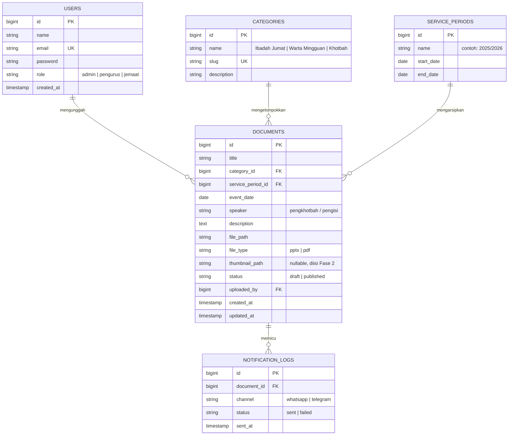
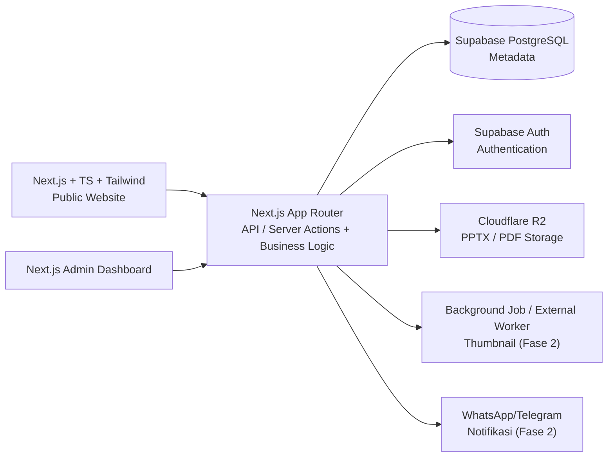
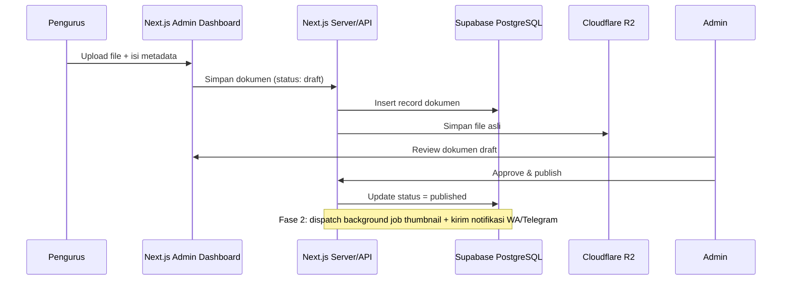
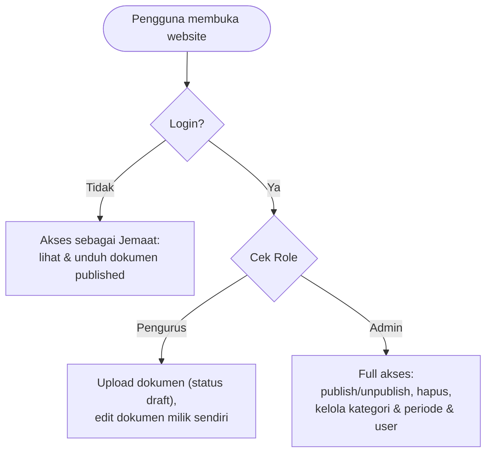

# ERD & Diagram Sistem — Website Arsip Digital PMK ITERA

Dokumen ini melengkapi `PRD.md`. Semua diagram ditulis dalam sintaks **Mermaid** — bisa langsung dirender oleh GitHub, editor Markdown modern, atau AI coding agent (Claude Code, Cursor, dll) sebagai acuan struktur teknis.

## 1. Entity Relationship Diagram (ERD)

### Catatan implementasi (Prisma migration)

- `users.role`, `documents.status`, `documents.file_type`, `notification_logs.channel/status` — implementasikan sebagai kolom `string` + validasi enum di level aplikasi (lebih portable antar DB) **atau** native Postgres `enum` bila tim nyaman migrasi manual.
- Tabel `notification_logs` dan kolom `thumbnail_path` baru dipakai di **Fase 2** — boleh dibuat nullable/kosong dari awal supaya skema tidak berubah drastis nanti (hindari breaking migration).
- Tambahkan index pada `documents.category_id`, `documents.service_period_id`, `documents.event_date` untuk mempercepat filter arsip.

## 2. Diagram Arsitektur Sistem

## 3. Sequence Diagram — Alur Upload Dokumen

## 4. Flowchart — Alur Akses Berdasarkan Role

